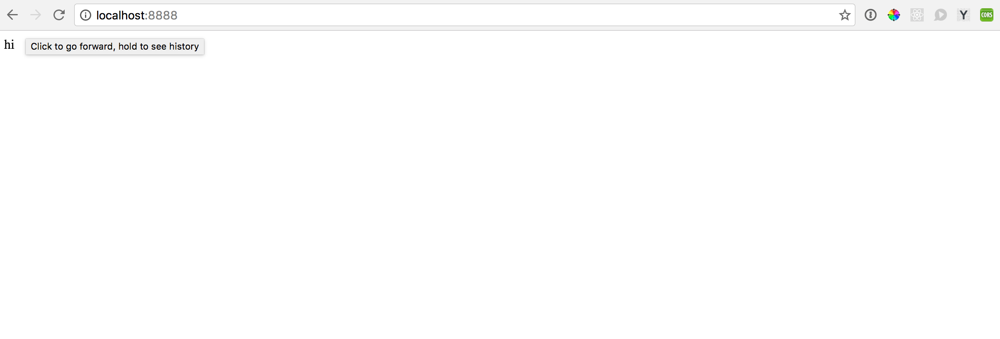
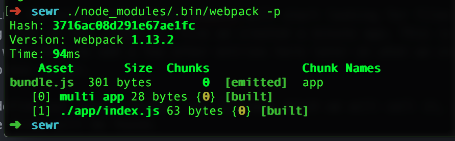
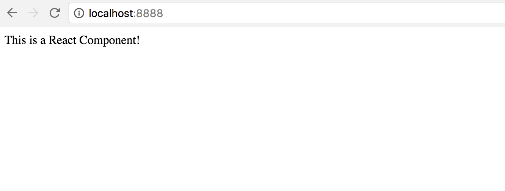

## The React and Socket.IO Development Environment
###### ( a love story )

---

Hi folks! Welcome back to another edition of "Learn some sh*t with Bryan!" (*Punchier name pending*)

A few days ago, I decided I wanted to work on my back-end skills. Ideally, I want to be an amazing front end developer, who is at least competent building out a server. So here we are, friends, standing on the precipice. Looking out over the void that is... Node.js.

Today, I want to help you get started with me. We will be creating an environment for you to take all your brilliant ideas (that would use React, Node, and Socket.IO). By the end of this tutorial, you will have a nice little boilerplate set up where you:

- Serve up your data with express
- Use react for the front-end (With some Hot Module Reloading Action!)
- Have Socket.IO integrated in to get started.

From here, the sky will be the limit! (That, and your JS chops, I suppose...)

Lets get started!
***

The first thing were going to do is create a new directory for our environment. We will call it "sewr" (for Socket.IO, Express, Webpack, and React) because its nice and short. You can obviously call it whatever you like.

    mkdir sewr && cd sewr && npm init

With this, we create the directory and initialize it with npm, which will give us a `node_modules` directory.

We will just hit enter through all the prompts, accepting the defaults for now, except for the `main` entry, which we will change to `server.js`. This is just for clarity when looking at the directory, and a personal preference.

Now lets get our dependencies in there!

    npm i express socket.io react react-dom --save

We are adding Express to create the server, socket.io for the webhooks connection, and react/react-dom for the front end. These are all saved as regular dependencies, meaning that the program needs them to run in production as well. Everything else we only need for development. We will add those now.

    npm i webpack webpack-dev-middleware webpack-hot-middleware babel-preset-es2015 babel-preset-react babel-loader babel-core --save-dev

Now that we have all our dependencies, lets create our server.
***
### Creating the server

First, let's create a few files and directories we will need.

    mkdir app dist

and

    touch server.js webpack.config.js .babelrc app/index.js

Now we can get our server going. In your favorite text editor, open up _server.js_.


    //server.js
    'use strict'

    const express = require('express');
    const app = express();
    const http = require('http').Server(app);
    const path = require('path');

    //set the port to 8888 or your previously chosen port
    const PORT = process.env.PORT || 8888;

    //send a test message to make sure its working
    app.get('/', (req, res) => {
    res.send('hi')
    });

    //start listening...
    http.listen(PORT, () => {
    console.log('Listening on port', PORT)
    });

lets also add a command to start the server in the _package.json_ file, as well as a 'build' command to compile our webpack stuff.

    //package.json
    ...removed for brevity...
    "scripts": {
      "test": "echo \"Error: no test specified\" && exit 1",
      "start": "node server.js",
      "build": "webpack -p"
    },
    ...

Now when we run `npm start`, node will run our _server.js_ file. if we direct our browser to http://localhost:8888, we should see our response message!


### Adding in Webpack

Next, we're going to get Webpack going so we can get a funky with our React-ish selves! Lets add just a dash of javascript to our _app/index.js_ file so we can see that Webpack is working properly.

    //app/index.js
    'use strict'

    console.log('this is working?!');

Okay, now we will hop into our _webpack.config.js_ file and get a bit of configuration going.

```javascript
//webpack.config.js
'use strict'

const webpack = require('webpack');
const path = require('path');

module.exports = {
  entry: {
    app: [ path.resolve(__dirname, 'app', 'index.js') ]
  },
  output: {
    path: path.resolve(__dirname, 'dist'),
    publicPath: '/dist/',
    filename: 'bundle.js'
  }
}
```

We are adding the entry point where webpack will start looking for files to bundle together. We are setting that to the _index.js_ file we created a minute ago. This is set up as an array because we will need to add a few other entries here later on when we start the webpack middleware for our express server.

After, we define our output folder, the filename which we will call it, as well as the public path where these files will be found.

Now if we run `npm run build`, we will see that webpack has created a new file _bundle.js_ (which we decided in the webpack config file) in the __dist__ directory (which we also determined via `path:`) from 1 file `./app/index.js`.


Neat!

### Make some React Happen!

Lets add React to our project! First, I'm going to create a few more files.

    touch app/App.js dist/index.html

Lets create a simple HTML page:

```HTML
<!doctype html>
<html lang="en">
  <head>
    <meta charset="utf-8">
    <meta name="viewport" content="width=device-width, initial-scale=1">
    <title>SEWR</title>
  </head>
  <body>
    <div id="root"></div>
    <script src='./bundle.js'></script>
  </body>
</html>
```
Nothing fancy here. We just created a DIV with an id of 'root' which we will use to inject our react components to the page. We are also including the bundled javascript file that webpack creates for us.

If we go back into our _server.js_ file, we can replace the

    `app.get('/', (req, res) => {
      res.send('hi')
    });`

with

`app.use(express.static(path.join(__dirname, 'dist')));`

With this change, we are telling Express to send the contents of the __dist__ folder we created on when it receives any requests. If we open up the developers console, we can see our _index.js_ message `is this working?!`. Success!

Now, lets add in React.

We can start by changing our _index.js_ file to take our _App.js_ file and render it to our _index.html_ like so:

    //app/index.js

    import React from 'react';
    import { render } from 'react-dom';
    import App from './App';

    //use our render method to place our App component in the div with the id of 'root'
    render(<App />, document.querySelector('#root'));

Now, lets create a little Component in _App.js_ to test:

    //app/App.js
    import React, { Component } from 'react';

    class App extends Component {
      render() {
        return (
          <div>
            This is a React Component!
          </div>
        )
      }
    }

    export default App;

If we try to bundle this all up with `npm run build` again, we get a scary warning message:


"You may beed an appropriate loader to handle this file type"

Oh yeah! Since we are using JSX, we need to let webpack know to expect some crazy symbols in our javascript file.

Lets go back into our _webpack.config.js_ file to add a module for our loaders. Lets put it right in between the entry and output properties. Our file should now look like this:

```
//webpack.config.js
//...removed...
app: [path.resolve(__dirname, 'app', 'index.js')]
},
module: {
  loaders: [
    //applying the babel-loader to any .js file in our app directory
    { test: /\.js$/, include: path.join(__dirname, 'app'), loader: 'babel-loader' }
  ]
},
output: {
```
Lets also now configure Babel for our uses in the _.babelrc_ file. All we need to do is add in the two presets we downloaded earlier.

_.babelrc_

    {
      "presets": ["react", "es2015"]
    }

If we compile our webpack again with `npm run build` it should work!


So thats all well and good, but if we need to make any changes to anything, we need to recompile our webpack bundle, restart our server, AND refresh the page. Thats asking a whole lot. In the next section, were going to add in some middleware to our express server to enable us to use the webpack dev server AND the hot module reloading on our own server! Weeeee!

### Adding in some middleware...

We already downloaded the dependencies earlier, so lets go back into our _server.js_ file and incorporate the middleware.

    //server.js
    
